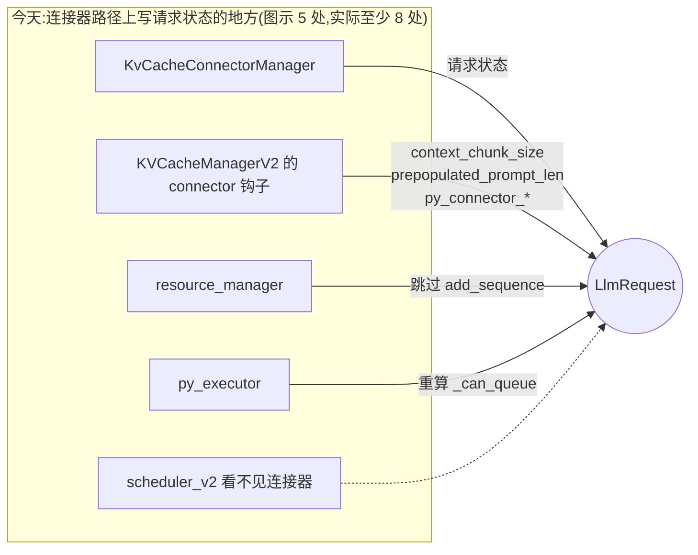
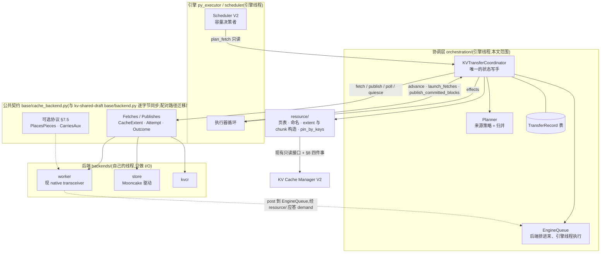
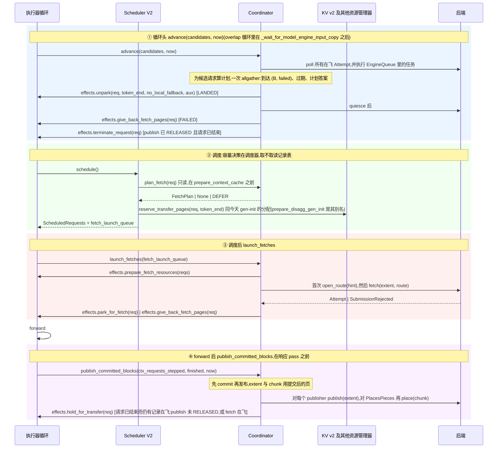
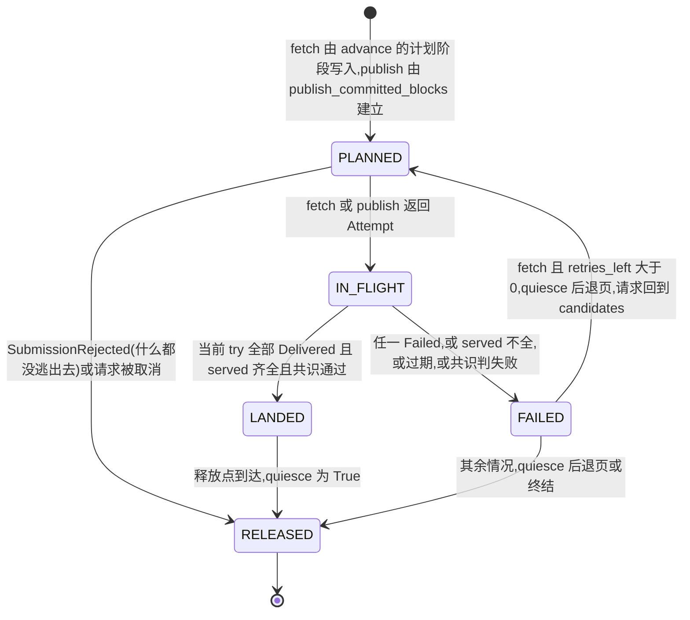
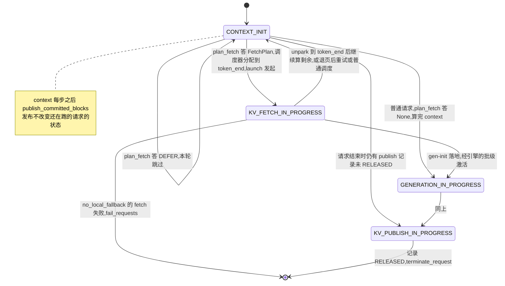
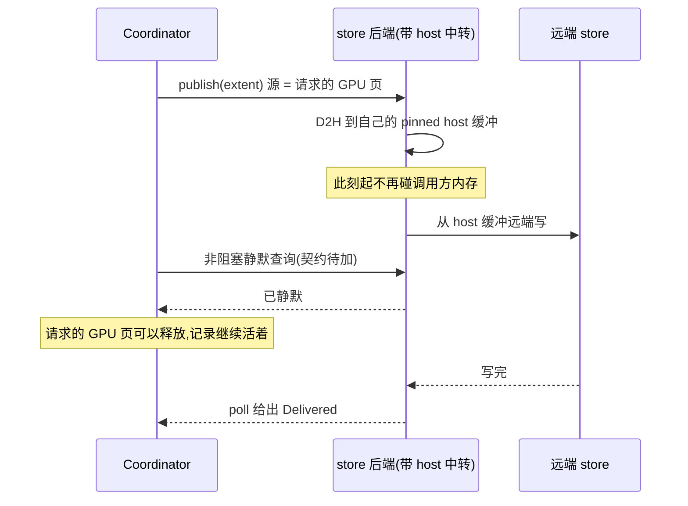

<!--
SPDX-FileCopyrightText: Copyright (c) 2026 NVIDIA CORPORATION & AFFILIATES. All rights reserved.
SPDX-License-Identifier: Apache-2.0
-->

# KV 传输协调层设计:引擎、KV Cache Manager V2 与传输后端之间的那一层

> **状态:草案 v4,讨论中。** 经三轮多视角评审(易读性、对照代码的可行性、可维护可扩展性)修订。
> 本文把 `docs/shared/README.md` §5 中今天只服务 disagg 的 `orchestration/` 层,扩展为所有传输后端共用的协调层。它建立在 `CACHE_BACKEND_SPEC.md` 规定的后端契约之上,不修改契约;需要契约变化的地方集中在 §11。
> **目标分支:`origin/feat/kv-shared-draft`(commit `2ea958f8817`)。** 规格在该分支上;契约代码在本分支以逐字节副本落在 `base/cache_backend.py`(与其 `base/backend.py` 同步;配对路径迁移后换名,见 `KV_TRANSFER_ALIGNMENT_PLAN.zh.md` §1、§6),`resource/naming.py` 与其只差一行 import。
> 范围只覆盖 PyTorch 执行器与 KV Cache Manager V2;V1 不在考虑之内。
> **「已定」** 是讨论已收敛的结论;**「待定 → §11 #n」** 指向待决问题表。
> 与 vLLM / SGLang 的逐条对照、源码行号、评审中否决的方案,在配套的 `KV_TRANSFER_COORDINATOR_DESIGN.notes.zh.md`。

## 一分钟版

1. 引擎侧只有一个组件管 KV 传输:`KVTransferCoordinator`。它在引擎线程上跑,为每个请求的每个方向(取 / 发)持有一条 `TransferRecord`,是传输状态的唯一写手。
2. worker(今天的 Python transceiver)、Mooncake 这类 store、KVCR 都是它下面的后端,只通过 `CACHE_BACKEND_SPEC.md` 的 `Fetches / Publishes` 契约交互;协调层不见地址。
3. **取**:循环头,协调层为候选请求算出"取不取、从哪取、取到哪个 token"的计划并在所有 rank 上取得一致;调度器评估请求时只读这份计划,按它分配页,把请求交给协调层发起;数据落地后协调层提交、放行,请求回到 `CONTEXT_INIT`,调度器看到更长的已提交前缀。
4. **发**:每个 context step 后协调层把已提交的块交给每个 publisher;请求状态不变,只有请求结束时发布还没完才多停一会。
5. 调度器只多认一个状态 `KV_FETCH_IN_PROGRESS`(不可调度),只多问一个只读钩子 `plan_fetch`,容量决策仍然全在它手里。
6. 一次取回整体成功或整体失败,少到了就退页、按到达情况缩小目标重来一次;失败是一等结局,每条记录有 deadline。
7. 对 KV Cache Manager V2 只要四件小事(§8);其余全用现有接口。
8. 删掉 KV connector、admission、transfer_manager;`DISAGG_*` 请求状态收敛为两个(需 C++ owner,期间用别名表)。

## 阅读指南

| 你想知道 | 看哪节 |
|---|---|
| 为什么要做这件事 | §1 |
| 目标与不做什么 | §2 |
| 系统长什么样,一轮循环里传输在哪几步 | §3 |
| 记录、请求状态、什么时候问 quiesce | §4 |
| 调度器要改什么 | §5 |
| 命名、层组、什么算"到了" | §6 |
| 各模块的职责和接口 | §7 |
| 对 KV v2 要什么 | §8 |
| 具体场景怎么走 | §9 |
| 以后加东西往哪加 | §10 |
| 还有什么没定 | §11 |
| 删什么、分几步 | §12 |
| 怎么测 | §13 |

---

## 1. 背景与问题

### 1.1 一段 KV 今天有几条路可以搬

README §1 把可复用的 KV 分成 self / peer / registry / store 四条路径。除 self(本地 radix tree 命中)之外,另外三条今天由两套互不相干的代码实现:

| README 的叫法 | 今天的实现 | 标识 | 与引擎的接缝 |
|---|---|---|---|
| peer | Python transceiver(`_torch/disaggregation/`) | request ID | `DisaggTransferCoordinator` + 6 个 effects |
| registry(router 知道谁有,按内容去取) | 无;本文 §9.3 用 peer 的同一个后端实现它 | content name | 无 |
| store | KV connector(`_torch/pyexecutor/connectors/`) | block hash | 散在四个模块里 |
| 未来:Mooncake、KVCR | 无 | content name | 无 |

`CACHE_BACKEND_SPEC.md` 已经统一了**数据面**:所有后端实现 `Fetches` / `Publishes`,以 `CacheExtent` 描述一次搬运、`Attempt` 表示异步句柄、`Outcome` 报告结局。但规格明确不管请求状态推进、超时、后端装配和调度接缝(SPEC §1)。这些是本文的范围。

几个贯穿全文的词:**effects** 是协调层反向调用引擎的一组回调(§7.3);**worker 后端**指实现 peer 路径的后端(今天的 native transceiver);**store 后端**泛指 Mooncake 这类按名字存取的后端(README 目录里叫 `blob/`);**gen-init** 是带 disagg 参数、要从 context worker 整段取回 prompt KV 的 generation 侧请求;**gen-first** 是 generation 侧先到、context 侧要等它就绪的 disagg 变体;**tpb** 是 `tokens_per_block`。

### 1.2 KV connector 的问题(这是要删掉的那一套)



- **状态写点散落。** 没有一处持有"这个请求的传输进行到哪一步"的完整记录。
- **在调度器之后动手。** 调度器按零命中分配容量;连接器随后从已调度批次中撤走待加载的请求,py_executor 只能事后重算 `_can_queue`。
- **拿裸地址,借用 disagg 状态,两套 API 才能支持 VSWA。** 所以 host tier、pool rebalance、offload 全部拒绝。

### 1.3 Python transceiver 好得多,但状态仍有三个写手

`DisaggTransferCoordinator` 已经把与 py_executor 的接缝收成 6 个 effects。但请求状态仍由 transceiver、coordinator、`transfer_manager.py` 三方分别推进,gen-init 走调度器的专用旁路 `fitting_disagg_gen_init_requests`,调度器要显式排除三个状态。

### 1.4 一个已被证伪的东西:独立的传输准入预算 「已定」

`orchestration/admission.py` 用 `max_tokens_in_buffer` 做块预算。但那描述的是 C++ transceiver 的物理 bounce buffer,Python transceiver 不消耗它。因此 `transfer_window_bypass_eligible` 在 **Python 异步传输 + KV v2 + PP1** 下整个跳过 admission,唯一的门就是调度器的 KV 容量检查。这条路径线上跑得好,说明独立预算不是必需的。本设计不再设第二本账。

---

## 2. 目标与非目标

| 编号 | 目标 |
|---|---|
| G1 | 引擎侧只有**一个**组件管 KV 传输,所有后端都在它下面 |
| G2 | 请求的传输状态只有**一份记录、一个写手、一个线程** |
| G3 | 传输决策在调度器**之内**做,不在调度器之后偷请求;容量决策仍只属于调度器 |
| G4 | 数据面全部走契约,协调层不见地址、不按后端类型分支 |
| G5 | full attention、VSWA(含 sink)、SSM/state 层组在同一套规则下工作 |
| G6 | 按层流式、host 中转、新后端都有明确的扩展点,且不改协调层 |
| G7 | 对 KV Cache Manager V2 的新增接口最少 |
| G8 | 删除 KV connector |

**非目标**:不修改后端契约(需要的变化在 §11);不设计路由,只消费随请求到达的路由提示;不设计线上报文,worker 后端沿用 native 协议;不覆盖 KV Cache Manager V1、同步传输模式与 C++ transceiver(待定 → §11 #8)。

---

## 3. 总体架构与一轮循环

### 3.1 分层



四条边界,每条只允许一种东西穿过:

| 边界 | 穿过的东西 | 不许穿过的东西 |
|---|---|---|
| 调度器 → Coordinator | `plan_fetch(req)` 只读询问,答案来自记录表 | 分配、状态修改、任何可能阻塞的调用 |
| 循环 ↔ Coordinator | 三个入口 + 一个钩子 + 一组 effects | 对请求字段的**写**(读 `py_disaggregated_params` 等是允许的) |
| Coordinator → 契约 | `CacheExtent` / `Attempt` / `Outcome` | 地址、request ID。`Unit.local_group` 这类本地坐标作为字段穿过契约,但不进线上报文、不参与命名 |
| 任何人 → KV v2 | 只经 `resource/` | 页对象、`_KVCache`、slot 内部结构。后端也不例外 |

**线程规则 「已定」**:协调层、记录表、`resource/` 对 KV v2 的调用只在引擎线程上。后端可以有自己的线程,但只做 I/O,不做集合通信,不碰 KV v2;需要 KV v2 的事(worker 按 key 应答 demand)`post` 进 `EngineQueue`,由协调层在循环头按预算执行,空闲路径也执行。纯 Python 的 KV v2 不是线程安全的。

### 3.2 一轮循环:三个入口和一个钩子



| 入口 / 钩子 | 何时 | 做什么 |
|---|---|---|
| `advance(candidates, now)` | 循环头 | 四个阶段:收(poll、EngineQueue)、算(候选请求的计划、过期判定)、齐(一次集合通信)、用(放行、退页、终结)。详见 §7.1 |
| `plan_fetch(req)`(钩子) | 调度器评估 context 请求时,**在** `prepare_context_cache` **之前** | 读记录表,答 `FetchPlan / None / DEFER`。不分配、不改状态、不阻塞 |
| `launch_fetches(queue, now)` | 调度后,forward 前 | 对调度器已分配的请求发起 fetch |
| `publish_committed_blocks(reqs, finished, now)` | 每个 context step 之后、响应 pass 之前 | 对本轮算了 context 的请求发起或推进 publish;`finished` 里的请求走 `notify_request_finished`,仍有记录在飞(publish 未 RELEASED,或 fetch 在飞)的 `hold_for_transfer` |

`candidates` = 处于 `CONTEXT_INIT` 且计划尚未决定的请求:新到的、上一轮 `DEFER` 的、失败后要重试的。计划在循环头算而不是在调度器里算,是因为 store 的 `probe` 可能要一个来回、路由提示异步到达,而计划必须在所有 rank 上一致。

`advance` 放在循环头,是为了让**本轮**调度就能看到上一轮落地的数据:请求 `unpark` 后回到 `CONTEXT_INIT`,调度器读到更长的 committed 前缀,自然跳过计算。今天 `poll_gen_transfers` 也在 `_schedule` 之前。

---

## 4. 记录、请求状态与释放点

### 4.1 一条请求、一个方向 = 一条记录

```python
@dataclass
class AttemptRecord:
    attempt: Attempt
    outcome: Outcome | None = None      # poll 的结局
    try_index: int = 0                  # 第几次尝试(fetch 重试)
    source: str | None = None           # FetchSource.name
    route: Route | None = None          # worker 后端:随本次尝试打开,LANDED 或 quiesce 后 close

@dataclass
class TransferRecord:
    request_id: int
    direction: Literal["fetch", "publish"]
    state: RecordState
    plan: FetchPlan | None = None       # fetch:advance 的计划阶段写入
    extent: CacheExtent | None = None   # launch / publish 时才有,units 依赖调度器的分配
    attempts: list[AttemptRecord] = []  # 分块发送时一次 publish 多个,重试时跨 try 累积
    retries_left: int = 1               # fetch:served 不全时最多重来一次
    deadline: float | None = None       # fetch 与 publish 都有;worker 用 kv_transfer_timeout,store 可配
    abandoned: bool = False             # 过期或取消;传输本身无法叫停
```

**终态的定义**:当前 `try_index` 的每个 attempt 都有 `outcome` 才算到终态。全部 `Delivered` 且合并后的 `served` 满足 §6.3 的 B = token_end 为 `LANDED`;任一 `Failed` 或 `Cancelled(by_peer)`,或 served 不全,为 `FAILED`。



答 `None` 或 `DEFER` 的候选**不建记录**;`DEFER` 的下一轮仍在 `candidates` 里。

### 4.2 请求状态 「待定 → §11 #1」

请求对象上,与传输有关的状态收敛为两个,**只由 Coordinator 通过 effect 写**,是记录状态的投影:

| 状态 | 等价于 | 调度器怎么看 |
|---|---|---|
| `KV_FETCH_IN_PROGRESS` | 该请求有 fetch 记录处于 IN_FLIGHT(且 `plan.mode == PREFETCH`,§10.2) | 不可调度 |
| `KV_PUBLISH_IN_PROGRESS` | 请求**已经结束**,但有 publish 记录未到 RELEASED | 不参与调度 |

两条规则覆盖今天七个 `DISAGG_*` 状态:

1. **publish 不改变一个还在跑的请求的状态。** 继续 generation 的请求向 store 发布、或 context worker 边算后续 chunk 边发前面的 chunk(今天的 `DISAGG_CONTEXT_INIT_AND_TRANS`),状态不变。只有请求结束时仍有未 RELEASED 的 publish 记录,才进入 `KV_PUBLISH_IN_PROGRESS`。
2. **gen-init 不是状态,是计划阶段的一条短路规则**(§7.2);gen-first 的 context 请求等 generation 侧就绪,是计划阶段的 `DEFER` 答案。

gen-init 落地后到被真正调度之间,引擎还要准备 seq slot、sampler(§7.3 `unpark`)。这是引擎自己的中间态,今天叫 `DISAGG_GENERATION_TRANS_COMPLETE`,不属于协调层。

**待决(→ §11 #1 的一部分):** 今天 `hold_for_transfer` 对已结束而 **fetch** 仍在飞的请求也会被调用(`notify_request_finished` 对两个方向的记录一视同仁),而引擎侧实现 `PyExecutorKVTransferEffects.hold_for_transfer` 一律置 `KV_PUBLISH_IN_PROGRESS`——fetch hold 也如此。状态名与含义不符,但两者都在调度器排除区间之外,行为正确;随 C++ 枚举收敛一并处理。

`LlmRequestState` 是 C++ 枚举,经 nanobind 暴露;gen-init 请求在 C++ 构造器里就带 `kDISAGG_GENERATION_INIT`;C++ 的 `createResult` 按 disagg 状态决定是否附带 `contextPhaseParams`;Python 侧约 60 处枚举使用加约 34 处 `is_disagg_*` 属性。这是 batch_manager owner 范围的改动。在它完成之前,协调层用**别名表**工作(§12.2)。

### 4.3 两条轴与释放点 「已定」

契约把"结果是什么"和"后端还在不在碰内存"分成两个问题:

| 动作 | 对谁 | 意思 |
|---|---|---|
| `poll` → `Delivered / Failed` | 后端 → 协调层 | **逻辑结束**。可以推进请求、记账归还 |
| `quiesce(attempts)` → `True` | 协调层 → 后端 | **物理静默**。保证不再碰这几次交付涉及的任何内存。答 `False` 是合法答案:后端确认不了,再等也不承诺会变 |

**释放点**是唯一调 `quiesce` 的地方,都在结局已知之后,所以对现有后端它立即返回:

| 方向 | 释放点 | 之后做什么 |
|---|---|---|
| fetch | `FAILED` 之后、退页之前 | `give_back_fetch_pages` |
| fetch | 请求结束、释放页之前 | 正常终结 |
| publish | 当前 try 到终态时 | 记录 `RELEASED`;请求已结束的 `terminate_request` |

**协调层不需要"钉住(pin)"原语。** 每一次传输的本地端点都由一个活着的请求持有:fetch 的目的页和 publish 的源页都归请求自己的 `_KVCache`。页在释放点 `quiesce` 为 `True` 之后才交还,就不会在传输途中被分给别人;答 `False` 时页随请求一直被占着,这就是 SPEC 要求的"退出使用"。过了 `deadline` 仍不静默的,走今天的 poison 路径:请求失败,页隔离。

需要"按名字找到已提交的页并钉住"的只有一处:worker 后端**应答**别人按内容发来的 demand 时,那些页在 radix tree 里、不属于任何活请求。这由 `resource/pin_by_keys` 用 KV v2 已有的 hold/lock 机制完成(§8.2)。

---

## 5. 调度器接缝 「已定:不设独立准入」

容量决策只有一处:调度器。改动是**把今天 gen-init 的专用路径一般化**:

| 今天 | 本设计 |
|---|---|
| 请求创建时就带 `DISAGG_GENERATION_INIT` 状态 | 调度器评估任一 `CONTEXT_INIT` 请求时问 `plan_fetch`,在 `prepare_context_cache` 之前(`DEFER` 不白付一次建 / 删 cache) |
| 调度器为 gen-init 调 `prepare_disagg_gen_init(req)`,分配全 prompt 容量 | 调用同一个方法,多传一个 `token_end` |
| gen-init 不计入 `num_requests` / `num_tokens` 预算 | 有 `FetchPlan` 的请求同样不计入,否则它们会抢批次槽位 |
| 放进 `fitting_disagg_gen_init_requests` | 放进 `fetch_launch_queue`(同一个列表改名,gen-init 是特例) |
| 排除 3 个 DISAGG 状态 | 排除 1 个 `KV_FETCH_IN_PROGRESS` |
| draft 管理器的联合配对只看 prompt_len | 也按 `token_end` |
| PP:rank 0 的 canonical schedule 带 gen-init 请求 id | 也带每个请求的 `token_end`;跟随者在收到 schedule 与重跑 `schedule_request` 之间由协调层把计划写进记录表。跟随者分配不足今天就没有处理,本设计不改善(`_pp_retry_until_can_schedule` 只查 `scheduled_batch`) |

后端接不下(`SubmissionRejected`)时,`launch_fetches` 用 `give_back_fetch_pages` 把页退回,记录 `RELEASED`,请求回到 `candidates`,**不消耗** `retries_left`。这是唯一的背压机制。



**调度器只读 `FetchPlan` 和请求状态,永远不读记录表。** 这条不变量是 §10.2 按层流式以后能加进来的前提。

一个已知的、今天同样存在且同样没加门的问题:取回中的请求把 KV 占满,forward 没东西算。等有数据再决定。

---

## 6. 命名、层组与归并

### 6.1 名字

沿用 `resource/naming.py`:一个 unit 的名字是 `group_tag(pool_role, window_size) + block_key`。层组序号不参与(两侧编号不同),窗口大小和 pool role 参与(两侧一致)。**内容寻址只命名整块**,且 prompt 最后一个 token 不参与复用,所以按内容能取回的最远终点 `token_end ≤ ⌊(prompt_len − 1) / tpb⌋ · tpb`;尾部半块和 SSM 活状态只有 gen-init 需要,由 worker 后端按位置搬(§7.5 `PlacesPieces`)。

### 6.2 三种层组各要什么

下例 tpb 为一块的 token 数、窗口 3 块、1 块 sink,本地已命中块 0..1,取回到块 6 末尾(`token_end = 7·tpb`):

```
block     0     1     2     3     4     5     6   | partial
          |--- local hit --|                        blocks 0..1 already in local radix tree
                      |------- fetch range -------| blocks 2..6, token_end = 7*tpb

full-attn  .     .   [u2]  [u3]  [u4]  [u5]  [u6]     one unit per block
window W=3 .     .    .     .   [u4]  [u5]  [u6]     sink block 0 is local, so only the window
SSM/state  .     .    .     .    .     .   [u6*]     one unit: exact snapshot at end of block 6
partial                                             not named
```

| 层组 | 读法(SPEC §2) | extent 里的 unit | 目的地 |
|---|---|---|---|
| full attention | 分页,终点是**上界** | `[reuse_end, token_end)` 每块一个 | 页 |
| 窗口(含 sink) | 分页 | sink 块加窗口块 `[stale_end(token_end), token_end)`,减去本地已有的;由 `_stale_block_range(group, token_end)` 给出 | 页 |
| SSM/state | 状态,终点是**精确检查点** | 一个:`token_end` 所在块末尾的快照 | 请求自己的 SSM slot |

`reuse_end` 是本地命中的块边界;`stale_end` 是窗口组在给定 history 下不再读取的最后一块之后;**history** 是 KV v2 里"已算到哪"的水位,只能增不能减。SSM 之所以能命名:KV v2 提交时把快照挂到 radix tree 的某个 block 上,那个 block 有 key。

### 6.3 归并:什么算"到了" 「已定」

数据落地后,`Delivered.served` 是到达的 unit 名集合。定义 **B**:

> B = 最大的块边界,使得把 B 当作序列总长时,**每个层组仍需读取的 unit** 全在 `served` 里。full attention 组要 `[reuse_end, B)` 全到;窗口组要 sink 块和 `[stale_end(B), B)` 全到;SSM 组要**恰好** B 处的快照。

**第一版只接受 B = token_end。** 少到了一块也不在中途提交,而是退页、按 `served` 缩小目标、重来一次。原因是 KV v2 两条规则合起来不留中间态:

1. 预留目的页时必须把 history 一次声明到 `token_end`(今天 gen-init 就是这么做的;否则窗口组要为整段区间持有页,长 prompt 撑爆 SWA pool),而 history 只增不减,且窗口组在 `stale(token_end)` 范围内的块**根本没有页**。所以 B < token_end 时,`[B, token_end)` 既没数据也没页可算。
2. 非 `ALL_REUSABLE` 策略和所有 SSM 模型上,提交终点还必须等于 history。

第 1 条对所有配置成立,是主要理由。重试提示 = 按 full attention 组算出的 B(窗口组和 SSM 组在更小的目标下需要不同的 unit,重试时重新规划)。一个请求最多重试一次,再不成就当普通请求算。store 的 `probe` 让少到罕见。

---

## 7. 模块设计

### 7.1 `KVTransferCoordinator`

**职责**:持有全部 `TransferRecord`;是请求传输状态的唯一写手;把执行器循环的时序翻译成对契约与引擎的调用。**不做**:不决定容量(调度器),不决定取到哪(Planner),不搬数据(后端),不见地址(契约),不区分后端类型(装配表 + 可选协议)。

```python
@dataclass(frozen=True)
class FetchSource:
    name: str
    backend: Fetches
    hint_key: str | None        # 该后端认哪一个路由提示;None = 目的地唯一(store)

class KVTransferCoordinator:
    def __init__(self, sources: Sequence[FetchSource], publishers: Sequence[Publishes],
                 planner: Planner, reader: ResourceReader, effects: KVTransferEffects,
                 queue: EngineQueue, dist: DistLike, *,
                 fetch_timeout_s: float | None = None, publish_timeout_s: float | None = None,
                 attention_dp: bool = False, queue_budget: int = 64,
                 gather: Callable[[Payload], list] | None = None): ...

    # ---- 循环入口(每个 rank 每轮调用次数必须一致)----
    def advance(self, candidates: Sequence[RequestView], now: float) -> None: ...
    def launch_fetches(self, queue: Sequence[RequestView], now: float | None = None) -> None: ...
    def publish_committed_blocks(self, reqs: Sequence[RequestView], finished: Collection[int],
                                 now: float | None = None) -> None: ...

    # ---- 调度器钩子(只读、非阻塞)----
    def plan_fetch(self, req: RequestView) -> FetchPlan | None | Defer: ...

    # ---- 控制(不是入口)----
    def notify_request_finished(self, req: RequestView) -> None: ...  # 释放门:未在飞的 fetch 到释放点;在飞的记录 hold 请求
    def has_inflight(self) -> bool: ...                    # pace_idle 与基准门控用
    def inflight_request_ids(self) -> frozenset[int]: ... # 调度器的 protected_from_eviction 与释放门用
    def status_dump(self) -> dict: ...                     # hang detector 用(今天就有)
```

`reader` 是本 rank 的资源视图(extent 与 chunk 从它取);`gather` 可替换 `dist.allgather`,供测试注入。`registry: ActiveRequestRegistry` 已不在签名里——请求以 `py_request_id` 为键记在协调层自己的表中。

`advance` 的四个阶段,每个阶段只操作记录表:

**收**
- 对所有 `IN_FLIGHT` 记录的 attempt `poll`;fetch 记录按 §6.3 归并出本 rank 的 B。
- 执行 `EngineQueue` 里后端排进来的任务,每轮有数量预算。

**算**
- 对 `candidates` 算本 rank 的计划答案(§7.2)。
- 按 `now` 判定过期,置 `abandoned`。

**齐**(一次集合通信)
- payload:`[(record_id, B, failed)]`、过期的记录 id、`[(request_id, token_end | None | DEFER)]`。
- 范围:`world`;ADP 下改为本 PP 组(今天 `_gen_consensus` 的规则)。PP > 1 时计划答案不走 allgather,由 rank 0 决定并随 canonical schedule 下发。
- 归约:到达取 `MIN(B)`、`MAX(failed)`,因为各 rank 持有的层组不同,`served` 不同。计划答案:**任一 rank 答 `DEFER` 则 `DEFER`**(store 的 probe 异步到达,各 rank 先后不一);否则不一致取 `None`。

**用**
- `LANDED` 的 fetch:`effects.unpark(...)`,attempt 的 `route.close()`。
- `FAILED` 的 fetch:`quiesce` → `effects.give_back_fetch_pages(req)` → 有 `retries_left` 的回 `PLANNED` 并把 `served` 换算成重试提示,否则 `RELEASED`;`no_local_fallback` 的 `fail_requests`。
- 到终态的 publish 记录:`quiesce` → `RELEASED`;请求已结束的 `effects.terminate_request`。
- 写入本轮的计划答案,`plan_fetch` 随后只读它。

`abandoned` 的记录随后按结局处理:普通 fetch 晚到的 `Delivered` 照常 `unpark`(数据不浪费);`no_local_fallback` 的过期即 `fail_requests`,晚到丢弃,保持今天 `kv_transfer_timeout_ms` 的语义;publish 过期时今天 `check_transfer_timeouts` 会让 ctx 发送失败,本设计相同。

### 7.2 `Planner`

**职责**:来源策略(取不取、问谁、取到哪)和归并(§6.3)。它是唯一**为了做决策而读请求内容**的地方;extent 与 chunk 的构造、命名在 `resource/`。文件 `disaggregation/remote_cache.py`(README §5 的名字;类名说它做什么)。

```python
@dataclass(frozen=True)
class FetchPlan:
    token_end: int                              # 调度器按它分配;必须是块边界
    source: str                                 # FetchSource.name
    hint: Mapping[str, object] | None           # open_route 的输入,worker 后端才有
    no_local_fallback: bool                     # gen-init 为 True:失败只能 fail,不能本地重算
    units_by_group: Mapping[int, tuple[int, ...]] # 各层组要哪些块序号;归并与重试时对照
    unit_names: frozenset[bytes]                # 询问集合;served 是它的子集
    group_plans: tuple[GroupPlan, ...]          # 每层组的 (GroupSpec, ordinals);fetch_extent 按它造 unit
    block_keys: tuple[bytes, ...]               # context_block_keys(req) 的快照
    reuse_end: int                              # 计划时的本地命中末端(token 数)
    tokens_per_block: int
    mode: Literal["PREFETCH"] = "PREFETCH"      # 为 §10.2 预留

DEFER = Defer()                                 # 单例:本轮别调度它,下轮再问

class Planner:
    def __init__(self, sources: Sequence[FetchSource], reader: ResourceReader, tokens_per_block: int, *,
                 probe_budget_rounds: int | None = 2, probe_timeout_s: float | None = None,
                 clock: Callable[[], float] = time.monotonic): ...
    def probe_query(self, req) -> tuple[bytes, tuple[bytes, ...]] | None: ...  # 该问 store 什么;None = 无可命名整块
    def decide(self, req, probe_answers, *, retry_hint=None) -> FetchPlan | None | Defer: ...
    def forget(self, req_id: int) -> None: ...  # 请求结束,丢掉它的 probe 计时

def merge(plan: FetchPlan, served: frozenset[bytes]) -> int: ...            # §6.3:归并后的 B
def retry_hint_from(plan: FetchPlan, served: frozenset[bytes]) -> int: ...  # 重试时的 token_end 上界
```

probe 的等待有两个预算,先到者为准:`probe_budget_rounds`(按 `decide` 被调用的轮数计,`None` 关闭)与 `probe_timeout_s`(按 `clock` 计,从首次 `DEFER` 起);超过即视为 store 未命中,按本地计算。

**计划的决策顺序**(每个候选请求一次):

| 步 | 判断 | 依据 |
|---|---|---|
| 1 | 带 disagg 参数的 gen-init? | 短路:source = worker,token_end = prompt_len,no_local_fallback |
| 2 | gen-first 的 context 请求,generation 侧还没就绪? | `DEFER`(今天 `prepare_context_schedulable` 的逻辑) |
| 3 | 可命名整块数 > 本地命中块数? | `probe_context_reuse(req)` + `context_block_keys(req)` |
| 4 | 有哪个后端值得问? | 按装配表顺序:请求带 `hint_key` 对应提示的 worker 后端;或 `probe` 答案非空的 store 后端。`probe` 答 `None`(后端还没查完,或答不了)则 `DEFER`,超过一个小预算后当 `None` |
| 5 | token_end | worker:prompt 的整块末端;store:probe 答案的**连续**前缀末端;重试时用重试提示 |
| 6 | 一致性 | 计划只用所有 rank 相同的输入(prompt、路由提示、probe 答案);本地命中深度各 rank 可能不同,只用它裁 `units_by_group`,裁到空仍是合法计划(契约允许 units 为空) |

### 7.3 引擎 effects(`orchestration/kv_transfer/interfaces.py`)

Coordinator 通过 effects 反向触达引擎,这是它对引擎的全部依赖。引擎侧实现(`pyexecutor/kv_transfer/effects.py`,唯一写请求状态的地方)每个一行职责。旧路(disagg 配对路径)对应的是 `orchestration/interfaces.py` 与 `pyexecutor/disagg_adapter.py`,两对文件待 §12 统一后合并:

| effect | 新/旧 | 作用 |
|---|---|---|
| `park_for_fetch(reqs)` | 新 | 状态 → `KV_FETCH_IN_PROGRESS` |
| `unpark(req, token_end, no_local_fallback, aux)` | 新,合并今天两处 | 见下 |
| `give_back_fetch_pages(reqs)` | 改名自 `revert_ctx_alloc` | 对所有资源管理器 `revert_allocate_context`;请求 → `CONTEXT_INIT` |
| `prepare_fetch_resources(reqs)` | 改名自 `prepare_gen_resources` | spec / draft 资源管理器的准备 |
| `hold_for_transfer(reqs)` | 新 | 请求已结束但仍有记录在飞(publish 未 RELEASED,或 fetch 在飞):状态 → `KV_PUBLISH_IN_PROGRESS`(fetch hold 也置此值,§4.2 待决);释放 seq slot、spec 资源(今天 `AsyncTransferManager.start_transfer` 做的),对所有管理器 `release_index_slot`;页本身还锁着 |
| `terminate_request(req)` | 沿用 | 最终释放 |
| `stage_transfer_response(req, ...)` | 沿用 | ctx 侧响应 |
| `fail_requests(reqs, reason)` / `fail_fatal(exc)` | 沿用 | |

`unpark` 做四件事,不做第五件:

1. 写游标。`token_end == prompt_len`(gen-init)直接写 `context_current_position`,像今天一样;否则 `_settle_context_cursor(req, token_end)`。前者不能用后者:它会触发 C++ 断言 `prepopulatedPromptLen < promptLen`。
2. 对**所有**资源管理器 `try_commit_blocks`。请求之后重入调度时会按 `num_committed_tokens` 重新落游标,正因为这一步提交了,两者才一致。
3. 应用 `aux`(首 token、draft token、ctx_usage)。
4. 置状态:`CONTEXT_INIT`,或 gen-init 的"已落地待激活"。
5. **不**准备 seq slot 与 sampler:它们受 `max_num_sequences` 预算和 spec-decode 时序约束,留在引擎现有的批级钩子里。

`ExecutorEffects`、`FetchSource.backend`、`EngineQueue`、`DistLike` 都是 Protocol,`Planner` 的 `reader` 可替换,所以 Coordinator 能用假的 effects、假的 `Fetches`、假的 `dist` 做单元测试(§13)。

### 7.4 后端装配与路由

- 后端在装配期(`py_executor_creator`)一次性构造,活整个进程;实现了 `RegistersPools` 的,装配期把所有 pool 登记给它;需要引擎线程的,装配期拿到 `EngineQueue`。
- 装配把 fetch 后端排成有序表 `Sequence[FetchSource]` 交给 Coordinator 与 Planner;publish 后端是 `Sequence[Publishes]`。**加一个后端 = 新目录 + 装配表一行**。
- **路由只属于 worker 类后端。** `hint_key` 说明该后端认哪一个路由提示;`launch_fetches` 为本次尝试调 `open_route(hint)`,存在 `AttemptRecord.route`,`LANDED` 或 quiesce 后 `close`(尽早还 aux slot)。blob 后端(`backends/blob/`,Mooncake 驱动)`hint_key = None`,`open_route` 拒绝。
- 一个请求一次只从一个来源取。多来源不在第一版(§10.4)。

### 7.5 契约之外的可选协议 「已定」

第一版只有两个,都只有 worker 后端实现,放在 `orchestration/kv_transfer/interfaces.py`。与契约里 `RegistersPools` 同一套路:实现了才有此能力,用 `isinstance` 判断。**每个协议至少有一个成员**:空的 `@runtime_checkable` Protocol 对任何对象都判真。

- **`PlacesPieces.place(chunk: Chunk) -> Attempt`**
  解决:尾部半块、活 SSM 状态没有名字,只能按位置搬(README §2 的"放置入口")。`Chunk` 今天在 `base/backend.py`(配对路径的旧契约),kv-shared-draft 已把它搬到 `resource/page.py`;本分支随配对路径迁移一并跟进(ALIGNMENT_PLAN §6)。
  用法:Coordinator 从 `resource/` 一次拿到 `(extent, chunk)`,对所有 publisher 调 `publish(extent)`,对实现者再调 `place(chunk)`。
  附带语义:实现者按序列工作,**每个 chunk 都收到**;未实现者只在最后一个 chunk 收到一次 `publish`,且不得读 `is_last`。

- **`CarriesAux.aux() -> Mapping[str, object]`**(实现在 worker 的 `Attempt` 上)
  解决:首 token、draft token、ctx_usage 随 gen-init 的交付到达。
  用法:Coordinator 不解读,原样交给 `unpark`。

不是协议、但同属这一层的还有 **`EngineQueue.post(fn)`**:装配期注入给需要 KV v2 的后端,`advance` 的收阶段按预算执行。后端在 `fn` 里只能调 `resource/`(如 `pin_by_keys`),见不到 `_KVCache`。

---

## 8. 对 KV Cache Manager V2 的接口需求 「已定:最小化」

### 8.1 需要 KV v2 owner 做的四件事

| # | 在哪 | 改什么 | 为什么 |
|---|---|---|---|
| 1 | wrapper 新增 `reserve_transfer_pages(req, token_end)`;`prepare_disagg_gen_init(req)` 保留为 gen-init 的一行别名(`token_end=None`) | `None` 即缺省 `prompt_len`。传入时:history 声明到 `token_end`;像 gen-init 一样**关掉** `enable_swa_scratch_reuse`(否则 `resize` 断言);cached-token 归因用同一条件;`_assert_disagg_history_declared` 改为与 `token_end` 比较。**hybrid 重载**在此把 `token_end` 无条件登记为该请求的快照点:登记要在 `_apply_branch_snapshot_point` 补 `prompt_len` 缺省**之后**,且不能套 `point > current_position` 的过滤,否则 unpark 那一轮它已被剔掉 | `expect_snapshot_points` 每轮调度都被重建,写在请求上会被覆盖;hybrid 的 `try_commit_blocks` 只在 `context_current_position` 是快照点时提交并快照 |
| 2 | wrapper 新增 `context_block_keys(req) -> list[bytes]` | 十几行 glue:把 `_context_reuse_tokens(req)` 与 reuse scope 交给 runtime 公开的 `sequence_to_blockchain_keys` | 远端分支的 `cache_reuse.py` 已在调这个名字,方法本身还没写;多模态 digest token 由 `_context_reuse_tokens` 处理 |
| 3 | runtime `BlockRadixTree.match_keys(root_key, keys) -> ReuseMatch` | `_match_token_path` 去掉 token 的变体:沿 `next[key]` 走到第一个缺失,tokens 从 `Block.tokens` 取回,再走 `_prune_match(ssm_lc_id=None)`。**attention-only 剪枝**,SSM 快照由调用方单独核对 | children 本来就按 `BlockKey` 索引。若带 SSM 剪枝,匹配会被截到最近一个有快照的块 |
| 4 | runtime `create_kv_cache(reuse_scope, input_tokens=None, *, reuse_keys=None, ...)` | 与 `input_tokens` 二选一,走同一个 `_setup_for_reuse` | 让应答 demand 复用现有 hold/lock 机制 |

另外一处清理:`_settle_context_cursor` 里对 `py_connector_served_position` 的读取随 connector 删除。

**一条必须遵守的不变量**:context 侧**先 commit 再 publish,extent 与 chunk 用提交后的页**。提交时请求会放开窗口外的 stale 页,`allow_seq_rebasing` 还可能把页换成并发提交者的页;今天 `update_context_resources` 在 `_send_kv_async` 之前提交,正是这个顺序。

### 8.2 `resource/` 要补的两个服务

| 服务 | 做什么 |
|---|---|
| `pin_by_keys(reuse_scope, keys) -> ServedPages` | 引擎线程上:`match_keys` → `create_kv_cache(reuse_keys)`(**`mark_stats_excluded`**,否则污染复用统计和 pool 尺寸估计)→ `resume(stream)` 把页锁到 GPU → `get_aggregated_page_indices`。**`resume()` 返回 `False`(GPU 利用率超过 `max_util_for_resume`,或 OOM)时答空**,由后端报 `Delivered(served=∅)`:诚实的背压。`ServedPages.release()` 在 quiesce 后 `close()`;任何异常路径 `finally: close()` |
| chunk 构造(今天 `transceiver._build_prefill_extent` 的逻辑) | 输入:`py_last_context_chunk`、`prepopulated_prompt_len`、`context_remaining_length`、各层组的窗口、block id。两条策略一起搬:首个 chunk 含复用前缀;窗口组推迟到最后一个 chunk 整体发 |

代价(待定 → §11 #2):`resume` 会给 SSM 快照多复制一份到新 slot;在 host 的页被迁回 GPU 而不是直接从 host 发;GPU 紧张时拒答。第一版接受。其余全是现有接口,见附录 B。

---

## 9. 关键场景走读

### 9.1 disagg:generation 侧 gen-init

1. 请求带 disagg 参数到达,`CONTEXT_INIT`。`advance` 的计划阶段短路:source = worker,hint = ctx endpoint,token_end = prompt_len,no_local_fallback。
2. 调度器问 `plan_fetch` 得到计划,`prepare_context_cache` 做本地 reuse match(可能命中一段),调 `prepare_disagg_gen_init(req, prompt_len)`,放进 `fetch_launch_queue`。
3. `launch_fetches`:`prepare_fetch_resources`,`open_route(hint)`,`fetch(extent, route)`。extent 只含本地未命中的整块;尾部半块和活 SSM 由 worker 后端按位置带来。`park_for_fetch`。
4. 若干轮后 `advance`:`Delivered`,共识后 LANDED,`unpark(req, prompt_len, True, aux)`,`route.close()`。请求进"已落地待激活",下一轮批级钩子准备 seq slot 与 sampler 后进 `GENERATION_IN_PROGRESS`。
5. 请求结束时 fetch 记录到释放点:`quiesce`(立即返回)→ `RELEASED`。

### 9.2 disagg:context 侧发送(含分块 prefill)

1. 每个 context step 之后 `publish_committed_blocks(reqs, finished, now)`。`update_context_resources` 已经提交了本 chunk。
2. Coordinator 从 `resource/` 取该请求的 `(extent, chunk)`。worker 后端实现了 `PlacesPieces`,每个 chunk 都收到 `publish(extent)` 与 `place(chunk)`;是否真的分块发由它决定。非最后一个 chunk 时请求状态不变。
3. 最后一个 chunk 后请求结束,publish 记录仍在 `IN_FLIGHT`:`hold_for_transfer` → `KV_PUBLISH_IN_PROGRESS`,seq slot 与 spec 资源先还。这一步在同一轮的响应 pass 之前,`createResult` 才能照常附带 `contextPhaseParams`。
4. generation 侧拉完 → `Delivered` → 释放点 `quiesce` → `RELEASED` → `stage_transfer_response` → `terminate_request`。过期则失败,与今天相同。

### 9.3 跨请求:从别的 worker 按内容取

块编号沿用 §6.2 的例子:prompt 有 7 个整块(块 0..6),本地命中块 0..1。

1. 计划阶段:`context_block_keys` 给 key chain;请求带路由提示(router 说 worker A 报告过这些块)→ source = worker,token_end = 7·tpb。共识一致。
2. 调度器分配到 token_end,`launch_fetches` 发起 fetch,extent 为块 2..6 的 unit。
3. **A 侧**:worker 后端收到 demand,`post` 进 `EngineQueue`;下一轮 `advance` 的收阶段执行 `pin_by_keys`,锁住页;之后 worker 在自己的线程单边写入,回 `Delivered(served)`;`quiesce` 后 `release()`。demand 协议本来就容忍一轮延迟(今天早到的 demand 也是先存起来)。
4. **本地**:若 `served` 覆盖块 2..6 → B = token_end,`unpark(req, 7·tpb, False, None)`,下一轮只算尾部半块。若块 6 在 A 已被驱逐 → served 不全,记录 `FAILED`,`quiesce` → `give_back_fetch_pages`;重试提示 B = 6·tpb,下一轮该请求回到 `candidates`,以 token_end = 6·tpb 重新规划,最多一次。

### 9.4 从 store 取

同 9.3,差别:§7.2 决策第 4 步用 `probe(name, units)` 问 store 持有哪些;blob 后端(Mooncake 驱动)自己在后台查,查完之前 `probe` 答 `None`,请求 `DEFER` 一两轮;token_end 取答案的**连续**前缀末端;没有路由。`probe` 的答案只是建议(SPEC §6.2 不变式 8),取时少了就走 9.3 第 4 步的重试。

### 9.5 发布到 store

`publish_committed_blocks` 时,若装配了 blob publisher(Mooncake 驱动)且请求允许发布:extent = 已提交整块的 unit。blob 后端不实现 `PlacesPieces`,只在最后一个 chunk 收到一次。同名重复发布是合并(SPEC §6.3 实现要求 2)。请求若继续 generation,状态不变;若已结束而发布未 RELEASED,`hold_for_transfer`。每个已提交块都发,不按命中次数门控;要不要少发是策略开关,不影响正确性。

### 9.6 超时与取消

- 过期与 `abandon` 只把记录的 `abandoned` 置真。契约无撤销,目的页可能仍在被写。
- 请求**继续 parked**。`advance` 继续 poll;拿到结局后走正常路径(§7.1)。
- 响应路径今天按 `py_kv_transfer_timed_out` 分支;改后失败由 Coordinator 直接 `fail_requests`,响应路径不再需要这个分支。
- 引擎线程上不调 `settle`;`quiesce` 只在释放点调。

---

## 10. 扩展点:以后要加的东西往哪加

### 10.1 host memory 中转,为了早放 GPU 页

publish 到 store 或应答 demand 时,源页是 GPU 页;远端写慢,GPU 页一直锁到写完。想早释放,就先 D2H 拷到 host 缓冲,GPU 页立刻放开,远端写从 host 走。



契约已经容得下:两条轴互不蕴含,SPEC 明确写了"对端可以停止碰内存而关于结果的消息仍在路上"。缓冲归后端自己管,协调层、Planner、KV v2 都不知道它存在;这和 C++ NIXL 路径上的 bounce buffer 是同一思路。

要把"早静默"变成"早放页",现在预定两件事,以后不必重做记录模型:(1) 契约加一个**非阻塞的静默查询**(待定 → §11 #4),`advance` 的收阶段顺手问;(2) **记录可以比请求活得久**:`hold_for_transfer` 在静默后就释放页并终结请求,记录留到结局出来只为 ctx 响应。

第二条路是用 **KV v2 自己的 host tier 当源**:页提交后被 offload 到 host,publish 或应答 demand 直接从 host 页发(README §2 的"已提交(可寻址层)")。需要 `pin_by_keys` 有"只 hold 不 lock 到 GPU"的变体(§11 #2)和 `resource/` 页表给出 host 层地址。也不动协调层。

### 10.2 按层流式(`STREAMED` 模式)

今天的按层能力是给每个 `DecoderLayer` 挂 forward pre/post hook,转到 connector 的 `wait_for_layer_load / save_kv_layer`。问题不在 hook,在于 hook 里绕开协调层改状态。将来的形状:

```python
@runtime_checkable
class StreamsLayers(Protocol):
    def before_layer(self, layer_idx: int, attempts: Sequence[Attempt], stream) -> None: ...
    def after_layer(self, layer_idx: int, attempts: Sequence[Attempt], stream) -> None: ...
```

- 引擎只在有后端实现了它时才注册 hook,hook 体是一行转发;**身份靠 `attempts` 传**(今天 connector 靠 `bind_connector_meta`)。
- 请求带着"承诺前缀"进调度,边取边算;后端在 `before_layer` 里等这一层的数据。

现在就预定三件事,以后加它不改记录模型:(1) `FetchPlan.mode` 已留位,请求状态的投影按 `mode == PREFETCH` 判(§4.2);(2) `STREAMED` 的失败没有退页可言(请求已在跑),直接 `fail_requests`;(3) 协调层预留读接口 `attempts_for(reqs)` 给 hook 取身份。它还需要 KV v2 能表达"承诺 N 个 token 已算好但页还没写完",今天没有这个概念(待定 → §11 #3)。

### 10.3 新后端

`backends/<name>/` 实现 `Fetches` 和/或 `Publishes`,需要的可选协议按需实现;装配表加一行。协调层、Planner、调度器不改。

### 10.4 多来源

同时问 worker 与 store、失败回退:`FetchPlan.source` 变成有序列表,`advance` 的用阶段失败时换下一个来源重试,重试预算共用;`AttemptRecord.source / route` 已按尝试记录。记录模型不变。

---

## 11. 待决问题

| # | 问题 | 倾向 |
|---|---|---|
| 1 | 请求状态收敛为两个:C++ 枚举、nanobind、`createResult` 对 disagg 状态的依赖 | 做,与 batch_manager owner 另开一线;阶段 2 用别名表不等它 |
| 2 | `pin_by_keys` 用 `resume()` 的三项代价:SSM 快照多一份拷贝、host 页迁回 GPU、GPU 紧张时拒答 | 第一版接受;之后加"只 hold 不 lock、从 host 直接发"的变体,也是 §10.1 第二条路的前提 |
| 3 | 两个可选协议是否进契约;`STREAMED` 需要 KV v2 表达"承诺但未写完"的前缀 | 先放 `interfaces.py`,稳定后提进 SPEC;`STREAMED` 第一版不做 |
| 4 | 契约缺**非阻塞的静默查询** | 提进 SPEC;它是 §10.1 早放 GPU 页的前提 |
| 5 | store publish 的 deadline 缺省值;契约没有"撤回一次 publish" | worker 沿用 `kv_transfer_timeout`;store 给一个可配缺省;撤回另议 |
| 6 | 部分到达的就地提交(避免退页重来)需要 history 能回退,不只是放松 `commit()` 的断言 | 第一版不做;有数据表明重试成本高再提 |
| 7 | PP 跟随者分配不足今天就没有处理 | 与本设计无关的既有缺口,单列 |
| 8 | 同步传输模式与 C++ transceiver 是否还需要协调层支持 | 倾向不支持,与其退役节奏对齐 |
| 9 | store 侧的读租约(lookup 即 pin),彻底消掉"probe 说有、fetch 却没有" | 契约变化,先观察重试率 |
| 10 | 跨请求取回时,draft 模型的 KV 是否成为 unit | 待 spec-decode owner 意见 |

---

## 12. 迁移与删除清单

### 12.1 处置表

| 现有 | 处置 |
|---|---|
| `connectors/kv_cache_connector.py`、`kv_cache_layout.py`、`registry.py` | **删除**(G8) |
| `KVCacheManagerV2._run_kv_connector_hooks`、`_mark_connector_prefix_populated`、`report_batch_to_connector`、`_connector_may_serve`、`py_connector_*` 字段 | 删除 |
| `orchestration/admission.py`、`transfer_window_bypass_eligible` | 删除 |
| `orchestration/transfer_manager.py`(`AsyncTransferManager`) | 并入 `TransferRecord` 表(新路已是 `records.py`);它释放 seq slot / spec 资源的职责进 `hold_for_transfer` |
| `orchestration/coordinator.py`(`DisaggTransferCoordinator`) | 演化为 `KVTransferCoordinator` |
| `transceiver.py` 中的状态写点、`_positional_window`、`_build_prefill_extent` | 状态写点移除;来源策略移入 `Planner`;extent / chunk 构造移入 `resource/`;传输部分收进 worker 后端 |
| `fitting_disagg_gen_init_requests` | 改名 `fetch_launch_queue`,语义一般化 |
| `py_kv_transfer_timed_out` 及响应路径上的分支 | 删除;失败由 Coordinator 发 `fail_requests` |
| `DISAGG_*` 请求状态 | 收敛为两个(§4.2,待定 → §11 #1) |

### 12.2 分阶段

0. **落契约。** 已完成:契约以逐字节副本落在 `base/cache_backend.py`,`resource/naming.py` 与其只差一行 import;与 kv-shared-draft 的合并、配对路径迁移与契约换名见 `KV_TRANSFER_ALIGNMENT_PLAN.zh.md` §6。
1. **记录表与入口。** 只接 worker 后端。范围比"只有 gen-init"大:删 `transfer_manager.py` 就要有 ctx 侧的 publish 记录与 `hold_for_transfer`,删 `prepare_context_schedulable` 就要有计划阶段的 gen-first `DEFER`;计划的短路规则此时还没有消费者(调度器仍按 `DISAGG_GENERATION_INIT` 路由)。行为对照附录 C 逐行验证。**代码量与今天相当**,收益是单一写手和后面几步的基础。
2. **调度器接缝。** `plan_fetch` / `fetch_launch_queue`,`prepare_disagg_gen_init` 加 `token_end`。请求状态用别名表:`KV_FETCH_IN_PROGRESS ≡ DISAGG_GENERATION_TRANS_IN_PROGRESS`(调度器已排除)、`KV_PUBLISH_IN_PROGRESS ≡ DISAGG_CONTEXT_TRANS_IN_PROGRESS`(`createResult` 照常工作,前提是 `hold_for_transfer` 在响应 pass 之前),gen-init 到达时由一个 effect 归一为 `CONTEXT_INIT`。C++ 收敛另开一线。
3. **KV v2 四件事 + `resource/` 两个服务 + 内容寻址。** §8;worker 后端的 `serve.py`;接 store 后端。
4. **删 connector。**

---

## 13. 测试

三个测试面,不多不少:

- **后端一致性套件**:属于 SPEC,不在本文。
- **协调层状态机**:假的 `Fetches`(脚本化 `poll` 结局与 `quiesce` 答案)、记录调用的假 `ExecutorEffects`、假 `dist`、假 `ResourceReader`、假 `EngineQueue`;`advance` 的四个阶段可单独驱动;覆盖 §4.1 每条边、共识的 MIN/MAX 与 DEFER 规则、过期与晚到、`SubmissionRejected` 退页、重试一次、`pin_by_keys` 拒答。
- **归并规则**:纯函数 `merge(plan, served) -> B`,合成 full / 窗口(含 sink)/ SSM 层组;价值最高、依赖为零。

---

## 附录 A:术语

| 词 | 含义 |
|---|---|
| gen-init / gen-first | 见 §1.1 |
| demand | worker 后端之间的请求报文:我要这些 unit,写到我这些页 |
| unit | 一次传输里被单独命名、单独交付的内容单位,`group_tag + block_key` |
| extent / chunk | 一次交付的完整描述(名字、unit 列表、是否末次)/ 不可命名部分的按位置描述(`resource/page.py`) |
| Attempt / Outcome | 异步句柄 / 结局(`Delivered` / `Failed` / `Cancelled`) |
| served | `Delivered` 里实际到达的 unit 名集合,是询问集合的子集 |
| token_end | 一次 fetch 的目标终点(token 数),块边界;调度器按它分配 |
| B | 归并后可推进到的块边界(§6.3);第一版只接受 B = token_end |
| reuse_end / stale_end / history / stale | 见 §6.2 |
| quiesce | 协调层对后端:保证不再碰这几次交付涉及的内存 |
| settle | 契约里 `poll` 的阻塞形式;本文不在引擎线程上用 |
| 释放点 | 唯一调 `quiesce` 的地方,§4.3 表 |
| 退页 | `give_back_fetch_pages`:把调度器为 fetch 分的页退回 |
| TransferRecord / AttemptRecord | 一个请求一个方向的传输记录,跨重试 / 其中一次交付,§4.1 |
| 计划阶段 | `advance` 的第二阶段,为候选请求算 `FetchPlan / None / DEFER` |
| plan_fetch / DEFER | 调度器评估请求时的只读询问 / "本轮别调度它" |
| candidates | 处于 `CONTEXT_INIT` 且计划尚未决定的请求 |
| fetch_launch_queue | 调度器已分配、待协调层发起 fetch 的请求列表(今天的 `fitting_disagg_gen_init_requests`) |
| no_local_fallback | 计划上的标志:失败只能 fail,不能本地重算(gen-init) |
| effects | 协调层反向调用引擎的一组回调,§7.3 |
| EngineQueue | 后端把需要 KV v2 的工作排进来、协调层在引擎线程执行的队列 |
| worker 后端 / store 后端 | 见 §1.1 |
| blob 后端 | store 后端在代码里的落点:`backends/blob/backend.py::BlobStoreBackend` 只依赖 `backends/blob/store.py::BlobStore` 协议,同时实现 `Fetches` / `Publishes` / `RegistersPools`;驱动在 `backends/blob/drivers/` 下各一个模块(`mooncake.py`:连接配置、状态码翻译、注册表工厂;`memory.py`:进程内字典存储),经共用的 `blob/factory.py::build_blob_backend` 建后端 |
| parked | 请求处于 `KV_FETCH_IN_PROGRESS`,不被调度 |
| canonical schedule | PP 下 rank 0 决定、跟随者照做的调度结果 |
| ADP | attention data parallel |
| poison 路径 | 今天对无法确认已停止写入的 buffer 的处理:请求失败,内存隔离不再复用 |
| PREFETCH / STREAMED | 数据全落地再调度 / 边取边算(§10.2) |

## 附录 B:协调层用到的 KV v2 现有接口

| 协调层要做的 | 用什么 |
|---|---|
| 本地命中深度 | `probe_context_reuse(req)`,不占页 |
| 层组的读法、窗口、sink | `impl.layer_grouping` + `kv_cache_manager_py_config.layers`,`kv_extractor` 已在读 |
| 预留目的页 | `reserve_transfer_pages(req, token_end)`(§8.1 #1;gen-init 经别名 `prepare_disagg_gen_init(req)`);helix 用 `total_input_len_cp`,现有代码已处理 |
| 每层组的目的页 / slot | `get_aggregated_page_indices(group, valid_only=False)`、`get_ssm_block_base_index(group)`、`_stale_block_range(group, token_end)` |
| 落地后推进请求并提交 | 直接写游标或 `_settle_context_cursor(req, token_end, tpb)`(§7.3)+ `try_commit_blocks(req)`;`commit()` 自己推进 history |
| 退页 | `revert_allocate_context(req)` |
| ctx 侧早释放 | `release_index_slot(req_id)`;seq slot / spec 资源管理器的 `free_resources` |
| 布局指纹(store 命名用) | `resource/` 从 `pool_group_descs` 算 |
| 应答 demand 的钉住 | `create_kv_cache(reuse_keys)` → `mark_stats_excluded` → `resume()` → `get_aggregated_page_indices` → `close()`(§8.2) |

## 附录 C:今天 `DisaggTransferCoordinator` 处理的情况,在新设计里的去向

| 今天的行为 | 去向 |
|---|---|
| ADP 下错误投票(`tp_allgather`) | 保留:`advance` 齐阶段的共识 |
| 中毒 buffer → `fail_fatal` | 保留 |
| gen-first ctx 门控(`prepare_context_schedulable`) | 保留:计划答案 `DEFER` |
| `gen_only_no_context` 基准模式 | 保留:计划答 `None`;基准门控改用 `has_inflight()` |
| pipelined 分块发送 | 保留:`publish_committed_blocks` 每步调用,worker 实现 `PlacesPieces` |
| 子请求的投票 id | 保留:共识按记录 id |
| `AsyncTransferManager.start_transfer` 释放 seq slot、spec 资源、draft 的 index slot | 保留:`hold_for_transfer` |
| `pace_idle` / `poll_progress_when_idle` | 保留:循环层用 `has_inflight()`;空闲路径也执行 `EngineQueue` |
| 超时的 ADP allgather、`check_transfer_timeouts` 对 ctx 发送的超时 | 保留:并入共识;publish 记录有 deadline |
| aux 通道(首 token、draft token、ctx_usage) | 保留:`CarriesAux`,经 `unpark` 交给引擎 |
| 超时后晚到的数据 | gen-init 保持今天语义(过期即失败);普通 fetch 照常使用 |
| 同步传输模式 | 不支持(待定 → §11 #8) |
| beam search | 与今天相同:分块发送要求 beam == 1 |
| helix / CP | `prepare_disagg_gen_init` 已按 `total_input_len_cp` 处理;内容取回的 token_end 按全局长度 |
